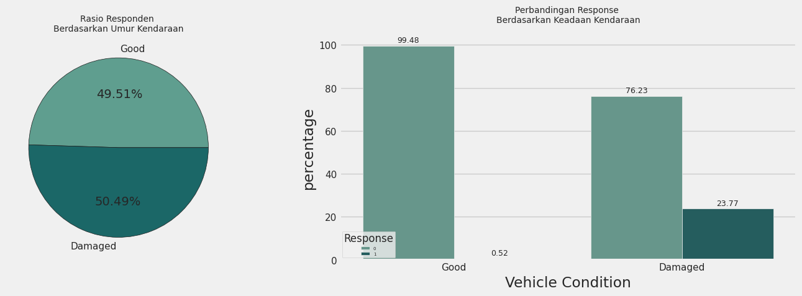

# Exploratory Data Analysis
Salah satu perusahaan asuransi yang berfokus ke penjualan 'Asuransi Kesehatan' ingin melakukan *cross-selling* produk 'Asuransi Kendaraan'. Perusahaan berharap dapat memprediksi apakah minat atau tidak pelanggan dari data-data pemegang polis 'Asuransi Kesehatan' yang sudah ada untuk itu dibutuhkan model yang dapat membantu proses tersebut.

EDA (Exploratory Data Analysis), dalam proses ini akan dilakuakn 4 tahap yakni melihat deskripsi statistik, analisis *univariate*, analisis *multivariate*, dan mengekstraksi business insight. Proses ini sangatlah penting sebelum membangun *Machine Learning*. Untuk memahami karakteristik data, dan hal-hal yang perlu
kita lakukan agar data tersebut dapat digunakan dilakukan proses EDA. 

Proses ini dapat membantu mendeteksi kesalahan dalam data, medeteksi data yang perlu di *handling*, melihat korelasi dan pola data, serta menemukan wawasan penting dalam data. Sehingga ketika memasukki proses pembuatan *Machine Learning* lebih efisien dan lebih tepat sasaran (akurat).

## Dataset Description

|**Kolom**|**Deskripsi**|
|:-------:|:-----------:|
|id|ID unik untuk setiap customer.|
|Gender|Jenis kelamin dari customer.
|Age|Usia customer.
|Driving_License|0 : customer tidak memiliki izin mengemudi, 1 : customer memiliki izin mengemudi.
|Region_Code|Kode unik untuk tiap wilayah customer. 
|Previously_Insured | 0 : Customer belum memiliki 'Asuransi Kendaraan', 1 : Customer sudah memiliki 'Asuransi Kendaraan'.
|Vehicle_Age | Usia dari kendaraan milik customer.
|Vehicle_Damage | 0 : Kendaraan customer belum pernah rusak, 1: Kendaraan customer sudah pernah rusak.
|Annual_Premium | Premi tahunan yang harus dibayar oleh customer.
|Policy_Sales_Channel | Kode channel/media yang digunakan untuk menghubungi customer.
|Vintage | Jumlah hari customer sudah bergabung dengan perusahaan.
|Response|0 : Customer tidak tertarik 'Asuransi Kendaraan', 0 : Customer tertarik 'Asuransi Kendaraan'.

## Prerequisites
1. Dataset download [`here`](https://www.kaggle.com/datasets/anmolkumar/health-insurance-cross-sell-prediction?select=train.csv).
2. `pip install requirement.txt`.

## Getting Started
- Statistical Descriptive
- Univariate Analysis
- Multivariate Analysis
- Business Insight

## **Statistical Descriptive**
1. Melakukan pengecekan missing values dengan menggunakan `.isna()`/`.isnull()` .

    >print(df.isnull().values.any()) 
    >print(df.isna().sum())

    **Kesimpulan**:   Tidak tedapat missing values di dataset ini.
2. Melakukan pengecekan nama kolom dan tipe data dengan menggunakan `.info()` .
    >df.info()

    **Kesimpulan**:
    * id = Sudah sesuai.
    * Gender = Sudah sesuai.
    * Age = Sudah sesuai.
    * Driving_License = Sudah sesuai.
    * Region_Code = Sudah sesuai.
    * Previously_Insured = Sudah sesuai.
    * Vehicle_Age = Lebih baik jika diubah menjadi integer, contoh dengan melakukan label encoding.
    * Vehicle_Damage = Tipe data lebih baik diseragamkan dengan boolean yang lain yakni integer.
    * Annual_Premium = Sudah sesuai.
    * Policy_Sales_Channel = Sudah sesuai.
    * Vintage = Lebih baik diubah menjadi Join_Duration.
    * Response = 0 : Sudah sesuai.

3. Mengecek ukuran pemusataan data dengan menggunakan `.describe()` .

    > df[num].describe()  
    > df[cats].describe()

    Serta mengecek ukuran penyebaran data.

    > nums = df[num]  
    for i in nums: 
    &nbsp;&nbsp;&nbsp;&nbsp;&nbsp;&nbsp;x = nums[i].mode()[0] 
    &nbsp;&nbsp;&nbsp;&nbsp;&nbsp;&nbsp;y = nums[i].value_counts()[x] 
    &nbsp;&nbsp;&nbsp;&nbsp;&nbsp;&nbsp;z = nums[i].nunique() 
    &nbsp;&nbsp;&nbsp;&nbsp;&nbsp;&nbsp;print(f'Terdapat {z} unique values dan modus dari kolom {i} = {x} dengan frekuensi sebesar {y}')  

    > nums = df[num] 
    for i in nums: 
    &nbsp;&nbsp;&nbsp;&nbsp;&nbsp;&nbsp;minv = nums[i].min() 
    &nbsp;&nbsp;&nbsp;&nbsp;&nbsp;&nbsp;maxv = nums[i].max() 
    &nbsp;&nbsp;&nbsp;&nbsp;&nbsp;&nbsp;Q1 = nums[i].quantile(.25) 
    &nbsp;&nbsp;&nbsp;&nbsp;&nbsp;&nbsp;Q3 = nums[i].quantile(.75) 
    &nbsp;&nbsp;&nbsp;&nbsp;&nbsp;&nbsp;total_range = maxv-minv 
    &nbsp;&nbsp;&nbsp;&nbsp;&nbsp;&nbsp;var = round(nums[i].var(),2) 
    &nbsp;&nbsp;&nbsp;&nbsp;&nbsp;&nbsp;iqr = Q3-Q1 
    &nbsp;&nbsp;&nbsp;&nbsp;&nbsp;&nbsp;print (f'Ukuran penyebaran dari kolom {i}, variance = {var}, range = {total_range}, IQR = {iqr}')

    **Kesimpulan**:  
    Dari kolom Age, Previously_Insured, median < mean sehingga ada berkemungkinan persebaran data positive skewed, sedangkan kolom Policy_Sales_Channel, Region_Code median > mean, yang kemungkinan negative skewed.

## **Univariate Analysis**
Analisis data terhadap satu feature saja tanpa melihat hubungan dengan features yang lain.

> for i in range(0, len(num)): 
  &nbsp;&nbsp;&nbsp;&nbsp;&nbsp;&nbsp;plt.subplot(1, len(num), i+1) 
  &nbsp;&nbsp;&nbsp;&nbsp;&nbsp;&nbsp;sns.boxplot(y=df[num[i]], color = '#E7CBA9', data=df, orient = 'v') 
  &nbsp;&nbsp;&nbsp;&nbsp;&nbsp;&nbsp;plt.tight_layout() 

Output:

    

> for i in range(0, len(num)): 
&nbsp;&nbsp;&nbsp;&nbsp;&nbsp;&nbsp;plt.subplot(2, len(num), i+1) 
&nbsp;&nbsp;&nbsp;&nbsp;&nbsp;&nbsp;sns.distplot(df[num[i]], color='#E7CBA9') 
&nbsp;&nbsp;&nbsp;&nbsp;&nbsp;&nbsp;plt.tight_layout(pad=2) 

Output:

    

>for i in range(0, len(num)): 
&nbsp;&nbsp;&nbsp;&nbsp;&nbsp;&nbsp;plt.subplot(1, len(num), i+1) 
&nbsp;&nbsp;&nbsp;&nbsp;&nbsp;&nbsp;sns.violinplot(y=df[num[i]], color='#E7CBA9', orient='v') 
&nbsp;&nbsp;&nbsp;&nbsp;&nbsp;&nbsp;plt.tight_layout() 

Output:

    

> for i in range(0, len(cats)): 
&nbsp;&nbsp;&nbsp;&nbsp;&nbsp;&nbsp;plt.subplot(len(cats), 1, i+1)  
&nbsp;&nbsp;&nbsp;&nbsp;&nbsp;&nbsp;sns.countplot(y=df[cats[i]], color='#E7CBA9')  
&nbsp;&nbsp;&nbsp;&nbsp;&nbsp;&nbsp;plt.tight_layout()  

Output:

    

**Kesimpulan**:
* ***Outliers***, pada kolom Annual_Premium terdapat outliers.
* **Distribusi data tidak normal**, banyak kolom yang distribusinya belum seimbang sehingga perlu dilakukan feature transformation.
* ***Class Imbalance***, melakukan *oversampling/undersampling* untuk kolom Response dengan perbandingan minimal 1:3.
* ***Feature Encoding***, pada kolom Vehicle_Age dan Gender  dilakukan *label encoding*.
* **Mengubah tipe data**, mengubah tipe data Vehicle_Damage menjadi numerik dengan astype()/pd.numeric(). 

## **Multivariate Analysis**
Analisis data terhadap suatu feature untuk melihat hubungan/korelasi dengan features yang lain.

> plt.figure(figsize=(8, 8)) 
&nbsp;&nbsp;&nbsp;&nbsp;&nbsp;&nbsp;sns.heatmap(df[num].corr(), cmap='Purples', annot=True, fmt='.2f') 

Output:

    

> plt.figure(figsize=(15, 15)) 
&nbsp;&nbsp;&nbsp;&nbsp;&nbsp;&nbsp;sns.pairplot(df, diag_kind='kde',hue='Response') 
&nbsp;&nbsp;&nbsp;&nbsp;&nbsp;&nbsp;sns.pairplot(df, diag_kind='kde',hue='Response')

Output:

    

**Kesimpulan**:
1. Features yang relevan untuk dipertahankan?
    * Target memiliki korelasi tinggi dengan Previously_Insured sebesar -0.34 yang berarti berkorelasi negatif.
    * Target memiliki korelasi tinggi dengan Vehicle_Damage sebesar 0.35 yang berarti berkorelasi positif..
2. Pola menarik?
    * Heatmap:  
    Tidak ada kolom numerik yang berkorelasi kuat. 
        ###### Note: korelasi kuat adalah nilai ">0.7" (kemungkinan redundant)

    * Pairplot:  
    Orang-orang yang sebelumnya belum pernah menggunakan asuransi kendaraan  di umur 35 sampai 45 dan juga di umur 60 sampai 65 cenderung menjawab response 1.
    Orang-orang yang mempunyai driving license di umur 35 sampai 45 dan juga diumur 60 sampai 65 cenderung menjawab response 1.
        ###### Note: Response 1 yang artinya pelanggan tertarik untuk membeli asuransi kendaraan.

## **Business Insight**

    

    

* Pelanggan yang lebih muda cenderung lebih tertarik dengan asuransi kendaraan daripada pelanggan yang lebih tua. Kita juga dapat melihat bahwa sebagian besar pelanggan berusia antara 20 hingga 60 tahun.

* Business Recommendation : Fokus pada segmen pasar yang berusia dibawah 50 tahun, untuk menawarkan produk asuransi kendaraan yang sesuai dengan kebutuhan dan preferensi mereka. Misalnya, produk asuransi yang memberikan perlindungan lebih luas, fleksibilitas pembayaran, dan kemudahan klaim.
 
 

    

* Berdasarkan data, total respon pelanggan dengan usia kendaraan 1-2 tahun lebih banyak, diikuti oleh pelanggan dengan usia kendaraan < 1 tahun dan > 2 tahun.

* Namun, jika dibandingkan persentase jumlah seluruh pelanggan terhadap ketertarikan pada setiap grup usia kendaraan, persentase grup usia kendaraan >2 tahun paling banyak memberikan respon, sebesar 29,37%, diikuti oleh pelanggan dengan usia kendaraan 1-2 tahun  sebanyak 17,38% , dan pelanggan dengan usia kendaraan <1 tahun sebesar  4,37%.

* Berdasarkan data tersebut, diketahui  bahwa usia kendaraan mempengaruhi ketertarikan pelanggan terhadap asuransi kendaraan.
Business Recommendation : Untuk meningkatkan ketertarikan dari customer, perusahaan dapat melakukan kerjasama dengan perusahaan bengkel otomotif untuk memberikan discount service berkala / sparepart kepada customer yang memiliki asuransi kendaraan. Selain itu, saat campaign produk juga perlu diberikan rincian perbandingan biaya service berkala/risk yang lain antara yang memiliki asuransi dan tidak, sehingga pelanggan dengan usia kendaraan yang masih tergolong baru juga tertarik untuk membeli asuransi kendaraan
 
 

    

* Dari grafik diatas, pelanggan yang bergabung dengan rentang waktu 5-8 bulan memiliki ketertarikan terhadap produk ‘Asuransi Kendaraan’ yang cukup banyak sekitar 19281 pelanggan, kemudian rentang waktu 1-4 Bulan sekitar 18038 pelanggan yang tertarik asuransi kendaraan dan yang paling sedikit tertarik asuransi kendaraan adalah pelanggan yang sudah bergabung diatas 9 bulan.

* Akan tetapi berdasarkan rasio persentase masing-masing vintage masih sangat kecil hanya 12% setiap group vintage.

* Business Recommendation : Untuk membuat pelanggan tertarik, dapat memberikan bundling produk asuransi bersama dengan asuransi kendaraan dengan gimmick “Paket Hemat” serta gratis biaya service pertama sejak membeli asuransi.
 
 

    

* Berdasarkan data, pelanggan asuransi dengan gender laki-laki lebih banyak dibandingkan dengan pelanggan perempuan. 

* Berdasarkan dari data, mayoritas pelanggan merupakan berjenis kelamin laki-laki sebesar 206.089 (54,08%) orang dari total 381.109 orang, sedangkan 175.020 (45.92%)  adalah perempuan.

* Berdasarkan gender ketertarikan terhadap produk ‘Asuransi Kendaraan’  kebanyakan laki-laki 28.525 (13,84% respon menunjukan ketertarikan) sedangkan, perempuan 18.185 (10.39% respon menunjukan ketertarikan). 

*  Business Recommendation : Masih rendahnya rasio dari total pelanggan terhadap ketertarikan “Asuransi Kendaraan” baik pelanggan laki-laki maupun perempuan, untuk meningkatkan respon dari pelanggan terhadap asuransi kendaraan dengan tidak hanya menawarkan asuransi tetapi memberikan edukasi pentingnya asuransi kendaraan untuk jangka panjang.
 
 

    

* Berdasarkan grafik diatas pelanggan yang memiliki Driving License lebih cenderung tertarik dengan penawaran Asuransi Kendaraan.

* Business Recommendation : Perusahaan dapat menargetkan pemasaran ‘Asuransi kendaraan’ kepada customers yang telah memiliki izin mengemudi. Untuk itu perusahaan dapat membuat campaign yang mungkin disertai dengan promo spesial penjualan perdana produk ‘Asuransi Kendaraan’ dengan syarat menyertakan SIM mereka, dengan begitu perusahaan akan dengan mudah mendapatkan target customers yang telah memiliki SIM.
 
 

    

* Dari data terdapat 192.413 pelanggan yang memiliki kendaraan yang buruk dan 188.696 yang memiliki kendaraan yang masih tergolong bagus.

* Berdasarkan dari keadaan kendaraan milik pelanggan, pelanggan yang memiliki kondisi kendaraan yang buruk lebih berminat terhadap ‘Asuransi Kendaraan’ dengan total 45.728 orang menjawab ‘Berminat’ dibandingkan pelanggan yang memiliki kendaraan yang masih tergolong bagus, dimana hanya 982 orang menjawab ‘Berminat’.

* Business Recommendation : Karena tingginya minat customers yang memiliki kendaraan kondisi rusak terhadap ‘Asuransi Kendaraan’ maka perusahaan dapat bekerja sama dengan bengkel-bengkel dalam pemasaran dan membuat penawaran produk yang bervariatif berdasarkan kebutuhan customers, seperti penawaran jangka yang bervariatif, coverage yang variatif.
 
 

    

* Dari 206.481 pelanggan yang belum memiliki ‘Asuransi Kendaraan’ terdapat 22.55% (46.552 orang) berminat terhadap ‘Asuransi Kendaraan’ yang ditawarkan oleh perusahaan dan 174.628 pelanggan yang sudah memiliki ‘Asuransi Kendaraan’ dimana walaupun sudah memiliki terdapat 0.09% (158 orang) juga berminat.

* Pelanggan yang belum memiliki ‘Asuransi Kendaraan’ sebelumnya lebih berminat terhadap produk cross-selling ‘Asuransi Kendaraan’.

* Business Recommendation : Melakukan campaign mengenai pentingnya asuransi kendaraan terutama kepada customers yang tercatat belum memiliki ‘Asuransi Kendaraan’. Dimana mayoritas dari customers yang belum memiliki asuransi tersebut memiliki kendaraan yang tergolong rusak dan sudah tua yang telah memberi respon positif ke produk ‘Asuransi Kendaraan’ yang akan ditawarkan.
 
  
